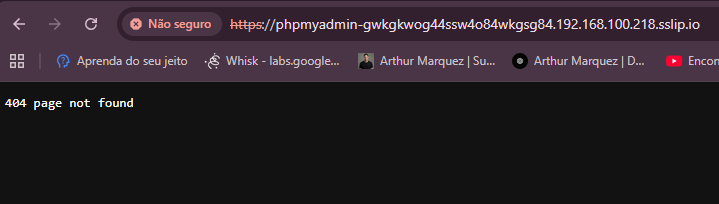

# Guia de Acesso ao PHPMyAdmin - Ice Van

## 📊 Status Atual dos Containers

### Containers Ativos:
- ✅ **icevans_db** - MySQL rodando na porta 3307
- ✅ **icevans_phpmyadmin** - PHPMyAdmin rodando na porta 8090

### Última Atividade:
- PHPMyAdmin foi acessado com sucesso hoje (02/03/2026 às 18:09)
- Banco de dados `icevans` está acessível

---

## 🔐 Credenciais de Acesso

### PHPMyAdmin Local (Desenvolvimento)
- **URL:** http://localhost:8090
- **Servidor:** db (ou deixe em branco)
- **Usuário:** root
- **Senha:** icevans123

### Banco de Dados MySQL
- **Host:** localhost
- **Porta:** 3307
- **Banco:** icevans
- **Usuário:** icevans (ou root)
- **Senha:** icevans123

---

## 🚀 Como Acessar o PHPMyAdmin

### Método 1: Navegador
1. Abra seu navegador
2. Acesse: http://localhost:8090
3. Faça login com as credenciais acima

### Método 2: Via Coolify (Produção)
Se você configurou o PHPMyAdmin no Coolify:
1. Acesse: https://coolify.integrasac.com.br
2. Vá para o projeto Ice Van
3. Procure pelo serviço PHPMyAdmin
4. Clique no link de acesso

---

## 🔧 Comandos Úteis do Docker

### Verificar Status dos Containers
```bash
docker ps -a
```

### Iniciar os Containers (se estiverem parados)
```bash
docker compose up -d
```

### Parar os Containers
```bash
docker compose down
```

### Reiniciar Apenas o PHPMyAdmin
```bash
docker restart icevans_phpmyadmin
```

### Reiniciar Apenas o MySQL
```bash
docker restart icevans_db
```

### Ver Logs do PHPMyAdmin
```bash
docker logs icevans_phpmyadmin --tail 50
```

### Ver Logs do MySQL
```bash
docker logs icevans_db --tail 50
```

### Acessar o Container do MySQL (linha de comando)
```bash
docker exec -it icevans_db mysql -u root -picevans123
```

---

## ⚠️ Problemas Comuns e Soluções

### 1. "Não consigo acessar localhost:8090"

**Possíveis causas:**
- Container parado
- Porta 8090 em uso por outro serviço
- Firewall bloqueando a porta

**Soluções:**

#### a) Verificar se o container está rodando:
```bash
docker ps | grep phpmyadmin
```

Se não aparecer, inicie:
```bash
docker compose up -d phpmyadmin
```

#### b) Verificar se a porta está em uso:
```bash
netstat -ano | findstr :8090
```

Se estiver em uso por outro processo, você pode:
- Parar o outro processo
- Ou mudar a porta no docker-compose.yml

#### c) Verificar logs de erro:
```bash
docker logs icevans_phpmyadmin
```

### 2. "Erro de conexão com o banco de dados"

**Soluções:**

#### a) Verificar se o MySQL está rodando:
```bash
docker ps | grep icevans_db
```

#### b) Reiniciar ambos os containers:
```bash
docker compose restart
```

#### c) Verificar se o MySQL está aceitando conexões:
```bash
docker exec -it icevans_db mysqladmin -u root -picevans123 ping
```

### 3. "Access denied for user"

**Soluções:**

#### a) Usar as credenciais corretas:
- Usuário: `root`
- Senha: `icevans123`

#### b) Se esqueceu a senha, recrie o container:
```bash
docker compose down
docker volume rm icevans_db_data
docker compose up -d
```
⚠️ **ATENÇÃO:** Isso apagará todos os dados do banco!

### 4. "Container reinicia constantemente"

**Soluções:**

#### a) Ver logs de erro:
```bash
docker logs icevans_phpmyadmin --tail 100
```

#### b) Verificar memória disponível:
```bash
docker stats
```

#### c) Recriar o container:
```bash
docker compose down
docker compose up -d --force-recreate
```

### 5. "Porta 8090 já está em uso"

**Soluções:**

#### a) Identificar o processo:
```bash
netstat -ano | findstr :8090
```

#### b) Mudar a porta no docker-compose.yml:
```yaml
phpmyadmin:
  ports:
    - "8091:80"  # Mude de 8090 para 8091
```

Depois reinicie:
```bash
docker compose down
docker compose up -d
```

---

## 🌐 Acesso Remoto (Produção)

### Opção 1: Via Coolify
Se você configurou no Coolify, o PHPMyAdmin estará disponível em um domínio público.

### Opção 2: Túnel SSH
Para acessar o PHPMyAdmin do servidor remotamente:

```bash
ssh -L 8090:localhost:8090 usuario@seu-servidor.com
```

Depois acesse: http://localhost:8090

### Opção 3: Configurar Domínio
Adicione um domínio no docker-compose.yml e configure um proxy reverso (Nginx/Traefik).

---

## 🔒 Segurança em Produção

### ⚠️ IMPORTANTE: Nunca exponha o PHPMyAdmin diretamente na internet!

### Recomendações:

1. **Use autenticação adicional:**
   - Adicione autenticação HTTP básica
   - Use VPN para acessar
   - Configure IP whitelist

2. **Mude as senhas padrão:**
   ```yaml
   environment:
     MYSQL_ROOT_PASSWORD: senha-forte-aqui
     MYSQL_PASSWORD: outra-senha-forte
   ```

3. **Use HTTPS:**
   - Configure SSL/TLS
   - Use um proxy reverso (Nginx/Traefik)

4. **Limite o acesso:**
   - Não exponha a porta 8090 publicamente
   - Use apenas em localhost ou VPN

5. **Monitore os logs:**
   ```bash
   docker logs icevans_phpmyadmin -f
   ```

---

## 📦 Backup do Banco de Dados

### Via PHPMyAdmin (Interface Gráfica)
1. Acesse http://localhost:8090
2. Selecione o banco `icevans`
3. Clique em "Exportar"
4. Escolha o formato (SQL recomendado)
5. Clique em "Executar"

### Via Linha de Comando
```bash
# Backup completo
docker exec icevans_db mysqldump -u root -picevans123 icevans > backup_$(date +%Y%m%d).sql

# Backup de uma tabela específica
docker exec icevans_db mysqldump -u root -picevans123 icevans contacts > backup_contacts.sql

# Backup compactado
docker exec icevans_db mysqldump -u root -picevans123 icevans | gzip > backup_$(date +%Y%m%d).sql.gz
```

### Restaurar Backup
```bash
# Restaurar de arquivo SQL
docker exec -i icevans_db mysql -u root -picevans123 icevans < backup.sql

# Restaurar de arquivo compactado
gunzip < backup.sql.gz | docker exec -i icevans_db mysql -u root -picevans123 icevans
```

---

## 🔍 Verificação Rápida

Execute este comando para verificar se tudo está funcionando:

```bash
# Windows PowerShell
docker ps --filter "name=icevans" --format "table {{.Names}}\t{{.Status}}\t{{.Ports}}"
```

**Saída esperada:**
```
NAMES                  STATUS              PORTS
icevans_phpmyadmin     Up X minutes        0.0.0.0:8090->80/tcp
icevans_db             Up X minutes        0.0.0.0:3307->3306/tcp
```

Se ambos mostrarem "Up", está tudo funcionando! ✅

---

## 📞 Suporte

### Logs Completos
Se precisar de ajuda, envie os logs:

```bash
# Salvar logs do PHPMyAdmin
docker logs icevans_phpmyadmin > phpmyadmin_logs.txt

# Salvar logs do MySQL
docker logs icevans_db > mysql_logs.txt
```

### Informações do Sistema
```bash
# Versão do Docker
docker --version

# Informações dos containers
docker inspect icevans_phpmyadmin
docker inspect icevans_db
```

---

## 🎯 Checklist de Acesso

- [ ] Docker está instalado e rodando
- [ ] Containers estão ativos (`docker ps`)
- [ ] Porta 8090 está livre
- [ ] Navegador consegue acessar http://localhost:8090
- [ ] Login com root/icevans123 funciona
- [ ] Banco `icevans` está visível
- [ ] Consegue ver as tabelas

Se todos os itens estiverem marcados, o PHPMyAdmin está funcionando perfeitamente! ✅

---

## 📝 Notas Adicionais

### Diferença entre Desenvolvimento e Produção

**Desenvolvimento (Local):**
- URL: http://localhost:8090
- Credenciais: root/icevans123
- Dados: Locais no seu computador

**Produção (Hostinger/Coolify):**
- URL: Fornecida pelo Hostinger ou Coolify
- Credenciais: Diferentes (configuradas no servidor)
- Dados: No servidor de produção

⚠️ **Nunca use as mesmas credenciais em produção!**

---

## 🔄 Atualização do PHPMyAdmin

Para atualizar para a versão mais recente:

```bash
docker compose pull phpmyadmin
docker compose up -d phpmyadmin
```

---

**Última atualização:** 03/03/2026
**Versão do PHPMyAdmin:** 5.2.3
**Versão do MySQL:** 8.0
